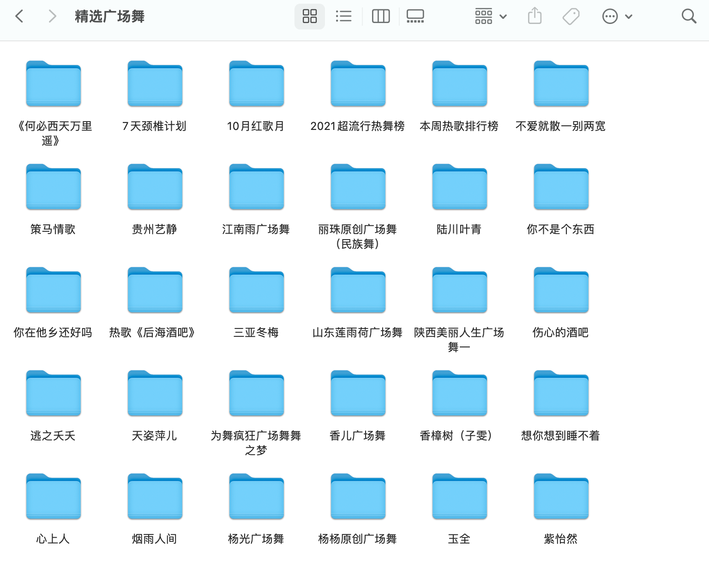

# 广场舞下载器

> 给老妈下载 43GB 的广场舞，支持断点继续下载

# 如何运行

## 安装 nodejs （已安装可跳过此步）

[https://nodejs.org/zh-cn/download/](https://nodejs.org/zh-cn/download/)

## 安装

`npm i square-dance-downloader --registry=https://registry.npmmirror.com/`

## 开始下载

在需要保存广场舞的文件夹中打开命令行，执行命令

`npx squareDancerDownloader`

## 下载效果

> 本代码只供 node、typescript 等技术交流学习，用于其他用途的造成不良后果自负

